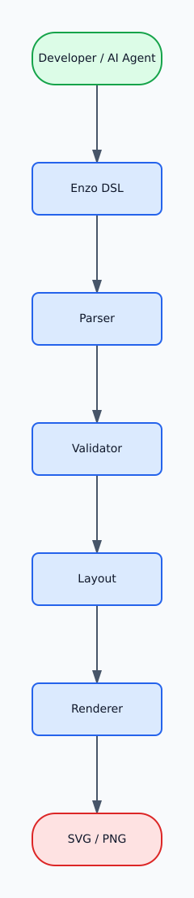
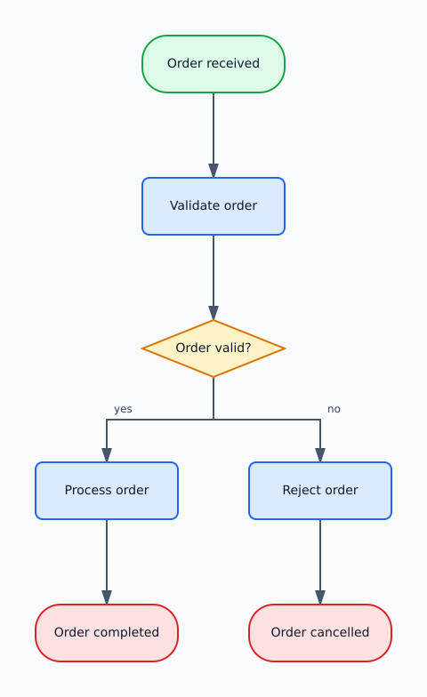
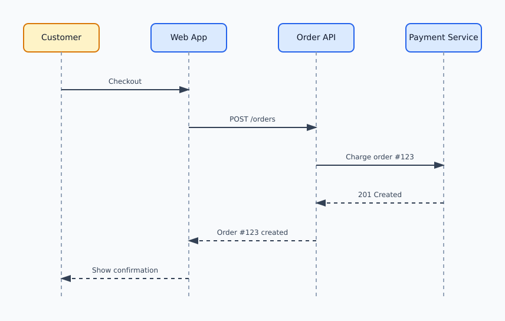
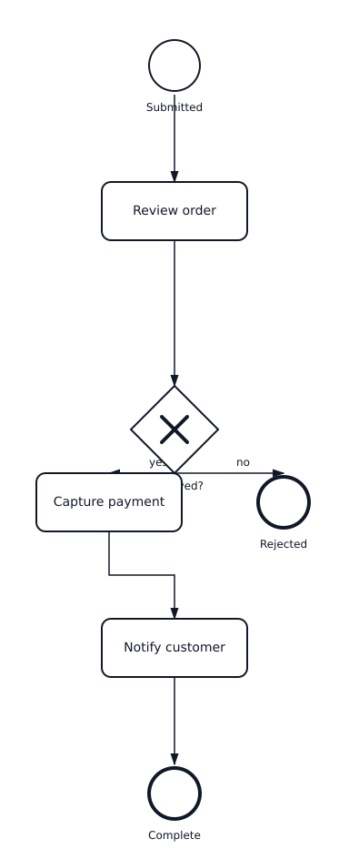

# Enzo.Diagrams

Enzo.Diagrams is a headless diagram-as-code engine for developers and AI agents. It provides a small DSL for flowcharts, sequence diagrams, and lightweight BPMN, then renders diagrams as SVG or PNG through a CLI or HTTP API.

Enzo.Diagrams owns the DSL, parser, validator, layout, and rendering pipeline. AI is optional: the engine does not call an LLM provider, but AI agents can generate Enzo DSL, validate it, render it, and return the generated diagram.

## Why Enzo.Diagrams?

- Small purpose-built DSL for common software diagrams.
- Deterministic rendering owned by the application, not an AI model.
- Headless CLI and HTTP interfaces for automation.
- Suitable for AI-generated diagrams without depending on a specific AI provider.
- SVG and PNG output for documentation, chat, tickets, and build pipelines.

## Architecture



The architecture asset above is generated by Enzo.Diagrams from [`docs/assets/architecture.enzo`](docs/assets/architecture.enzo).

```text
Developer / AI Agent
        |
        v
    Enzo DSL
        |
        v
+----------------------+
|    Enzo.Diagrams     |
| Parser -> Validator  |
| Layout -> Renderer   |
+----------------------+
        |
        v
     SVG / PNG
```

## Examples

### Flowchart

[`docs/assets/order-fulfillment.enzo`](docs/assets/order-fulfillment.enzo)

```text
flow OrderFulfillment

start Received "Order received"
task Validate "Validate order"
decision Valid "Order valid?"
task Process "Process order"
task Reject "Reject order"
end Complete "Order completed"
end Cancelled "Order cancelled"

Received -> Validate
Validate -> Valid
Valid -> Process : yes
Valid -> Reject : no
Process -> Complete
Reject -> Cancelled
```



### Sequence Diagram

[`docs/assets/checkout-sequence.enzo`](docs/assets/checkout-sequence.enzo)

```text
sequence Checkout

actor Customer "Customer"
participant Web "Web App"
participant Api "Order API"
participant Payment "Payment Service"

Customer -> Web: Checkout
Web -> Api: POST /orders
Api -> Payment: Charge order #123
Payment --> Api: 201 Created
Api --> Web: Order #123 created
Web --> Customer: Show confirmation
```



### Lightweight BPMN

[`docs/assets/order-approval-bpmn.enzo`](docs/assets/order-approval-bpmn.enzo)

```text
bpmn OrderApproval

start Submitted
task Review "Review order"
gateway Approved "Approved?"
task Capture "Capture payment"
task Notify "Notify customer"
end Complete
end Rejected

Submitted -> Review
Review -> Approved
Approved -> Capture : yes
Approved -> Rejected : no
Capture -> Notify
Notify -> Complete
```



## Usage

### .NET Global Tool

The CLI package is `Enzo.Diagrams.Cli`; the installed command is `enzo-diagram`.

```powershell
dotnet tool install --global Enzo.Diagrams.Cli
```

```powershell
enzo-diagram validate .\diagram.enzo
enzo-diagram render .\diagram.enzo
enzo-diagram render .\diagram.enzo --format png
```

`render` defaults to SVG and writes next to the source file unless `--output <file>` is provided. Custom output paths must stay inside the source file directory.

### HTTP API

The API exposes two primary endpoints:

- `POST /v1/validate`
- `POST /v1/render`

Hosted validation and rendering requests are protected with the `X-API-Key` header. Store keys in environment variables, secret stores, or the calling platform's secure configuration; do not commit API keys to source control.

```http
POST /v1/render
X-API-Key: <api-key>
Content-Type: application/json

{"source":"flow Demo\nstart Begin \"Begin\"\nend Done \"Done\"\nBegin -> Done","format":"svg"}
```

See [API authentication](docs/api-authentication.md) and the checked-in [agent OpenAPI contract](docs/openapi/agent.openapi.json).

### AI Agents / ChatGPT

The API does not call an LLM. An agent uses Enzo.Diagrams by generating Enzo DSL and calling the validation/rendering endpoints.

```text
User
  |
  v
AI Agent
  |
  v
Generate Enzo DSL
  |
  v
Validate
  |
  v
Render
  |
  v
SVG / PNG
```

Agents should:

1. Generate valid Enzo DSL.
2. Use `/v1/validate` for complex diagrams when appropriate.
3. Correct validation errors if necessary.
4. Call `/v1/render`.
5. Return the generated diagram.

See [AI integration](docs/ai-integration.md) for agent instructions and ChatGPT Action setup.

## Supported Syntax Overview

This is a compact overview, not the full language specification.

### Flow

```text
flow <Name>

start <Id> "<Label>"
task <Id> "<Label>"
decision <Id> "<Label>"
end <Id> "<Label>"

<Source> -> <Target>
<Source> -> <Target> : <Label>
```

### Sequence

```text
sequence <Name>

actor <Id> "<Display Name>"
participant <Id> "<Display Name>"

<Source> -> <Target>: <Message>
<Source> --> <Target>: <Response>
```

### BPMN Subset

The BPMN-inspired subset is not full BPMN 2.0. It supports start events, end events, tasks, exclusive gateways, sequence flows, and optional sequence-flow labels.

```text
bpmn <Name>

start <Id>
task <Id> "<Label>"
gateway <Id> "<Label>"
end <Id>

<Source> -> <Target>
<Source> -> <Target> : <Label>
```

Identifiers start with an ASCII letter or `_`, followed by ASCII letters, digits, or `_`. Keywords are lowercase and case-sensitive. Quoted labels use double quotes and cannot span multiple lines.

## Project Architecture

- `Enzo.Diagrams.Language` contains the lexer, parsers, validators, and layout models.
- `Enzo.Diagrams.Rendering` renders validated diagrams to SVG and rasterizes SVG to PNG.
- `Enzo.Diagrams.Api` exposes the validation and rendering HTTP endpoints.
- `Enzo.Diagrams.Cli` provides the `enzo-diagram` command-line tool.
- `Enzo.Diagrams.Core` is a shared core project currently present in the solution.
- `tests/` covers language, rendering, API, and CLI behavior.

## Deployment

The production API deployment path is:

```text
GitHub
  |
  v
GitHub Actions
  |
  v
Docker
  |
  v
GHCR
  |
  v
Azure Container Apps
```

Merges to `main` run the deployment workflow when API container inputs change. The workflow authenticates to Azure with GitHub OIDC, builds the API Docker image, pushes SHA-tagged images to GHCR, updates the Azure Container App, and keeps validation/rendering endpoints protected by `X-API-Key`.

See [Azure Container deployment](docs/azure-container-deployment.md) for deployment details without secret values.

## Development

```powershell
dotnet restore
dotnet build
dotnet test
```

Run the API locally:

```powershell
$env:Enzo__ApiKey = "<local-development-key>"
dotnet run --project src/Enzo.Diagrams.Api --urls http://localhost:5085
```

## Additional Documentation

- [API authentication](docs/api-authentication.md)
- [AI integration](docs/ai-integration.md)
- [Azure Container deployment](docs/azure-container-deployment.md)
- [Agent OpenAPI contract](docs/openapi/agent.openapi.json)

## Limitations

- No interactive frontend.
- No packaged SDK.
- BPMN support is a small inspired subset, not full BPMN 2.0.
- No comment syntax in the DSL.
- No escaped quotes or multiline string labels.
- CLI custom output paths are restricted to the source file directory.

## License Status

No license file is currently present in this repository. Until a license is added, do not assume open-source usage rights beyond viewing the public repository.
